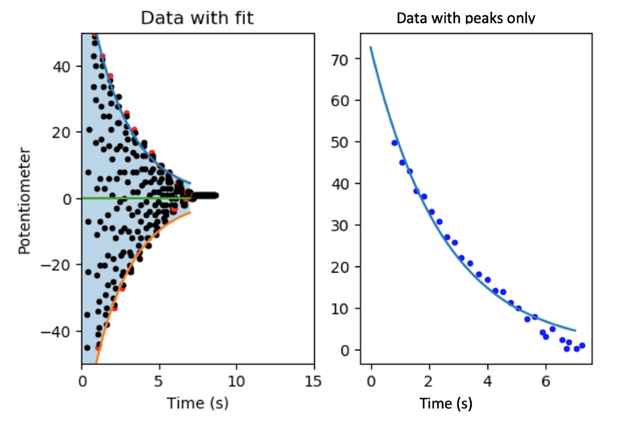

# Arduino-Pendulum-Recording-Script
A project I completed which takes input from a pendulum connected to an Arduino, and collects this data so pendulum motion can be studied. 

A potentiometer was connected to the inputs of an arduino, and a pedulum arm, weighted at the bottom was attached to the potentiometer. If we normalise the value from the potiometer to zero when the pendulum arm is stationary, we can then graph the resulting motion of the pendulum with respect to time.

The timestep of the data collection is large, so fitting a decaying oscillation to the data is innacurate. Instead, the peaks of the oscillation are found and fitted against.

See below the motion of the pendulum; A damped oscillation
![PendulumGraph2](PendulumGraph2.png
After finding the peaks and taking the magnitude of them, we can fit for the decay of the motion.

